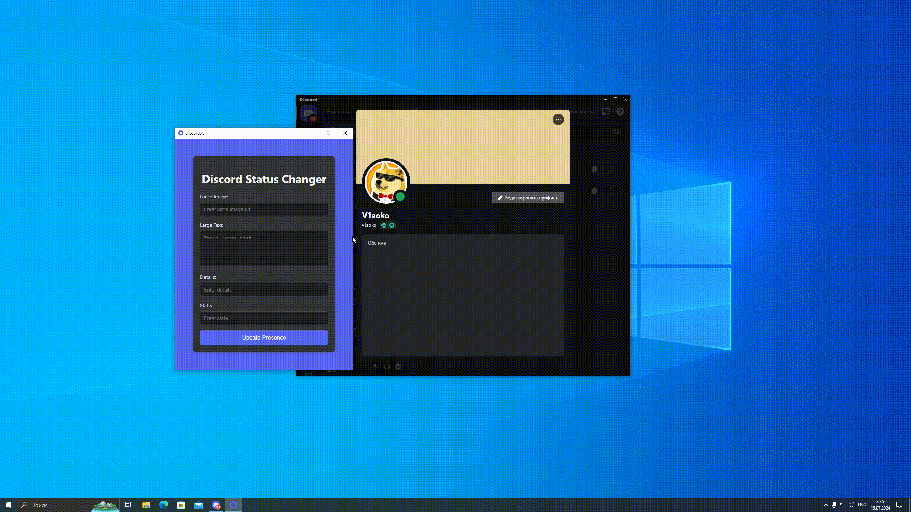

#  Discord Status Changer

**DiscordSC** is a sleek and efficient application that allows you to customize and update your Discord status with ease.

## Features

- **User-Friendly Interface**: Simple and intuitive UI for updating your Discord status.
- **Persistent Data**: Automatically saves your settings and status messages.
- **System Tray Integration**: Minimizes to the system tray for quick access.
- **Small and Lightweight**: Minimal resource usage ensures your system remains fast and responsive.

## Installation

1. **Clone the repository:**
   ```bash
   git clone https://github.com/Tsimbalist/DiscordSC.git
   ```

3. **Navigate to the project directory:**

    ```bash
    cd DiscordSC
    ```

3. **Install dependencies:**
   ```bash
   pip install -r requirements.txt
   ```

4. **Run the application:**
   ```bash
   python main.py
   ```

## Usage

1. **Launch the application**: The main window will open, displaying the interface for setting your Discord status.
2. **Update your status**: Fill in the fields with your desired status details and click the "Update Presence" button.
3. **Minimize to Tray**: Click the minimize button to hide the window and keep the application running in the system tray.
4. **Restore from Tray**: Click the tray icon to bring the application back to the foreground.

## Demo


